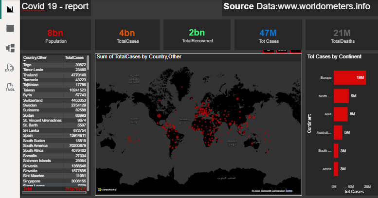

# covid19-global-impact-dashboard
🦠 لوحة بيانات تتبع جائحة كوفيد-19 العالمية | COVID-19 Global Tracker Dashboard
📝 وصف المشروع (Project Overview)
تم تصميم هذه اللوحة لتوفير نظرة شمولية وسريعة على الوضع الوبائي العالمي. تتيح اللوحة للمستخدمين تتبع الأرقام الضخمة وتوزيعها الجغرافي عبر القارات والدول، مما يسهل فهم حجم الجائحة وتأثيرها العالمي.
🛠️ المميزات والتحليلات (Key Features)
المؤشرات العالمية (Global KPIs):
إجمالي عدد السكان المشمولين بالدراسة (8 مليار).
إجمالي الإصابات المؤكدة، حالات التعافي، وحالات الوفاة (21 مليون حالة وفاة).
التحليل الجغرافي (Geospatial Analysis): خريطة حرارية تفاعلية (Map) توضح بؤر الانتشار حول العالم باستخدام النقاط الحمراء للتعبير عن كثافة الإصابات.
مقارنة القارات: رسم بياني شريطي (Bar Chart) يوضح توزيع الإصابات حسب القارات، حيث تظهر أوروبا كأعلى القارات تأثراً في هذا التقرير.
قائمة الدول التفصيلية: جدول مرن يعرض قائمة بكل الدول مع إجمالي الإصابات لكل منها (مثل سويسرا، السويد، جنوب أفريقيا، إلخ).
🧰 الأدوات والتقنيات (Tools Used)
Data Visualization: Power BI Desktop.
Data Source: Worldometers.info (Web Scraping/Data Integration).
Theme & Design: تصميم مخصص بنظام "Dark Mode" لتحسين تجربة المستخدم وإبراز البيانات المهمة.
DAX Measures: لعمل الحسابات التجميعية ونسب الوفيات والتعافي.

